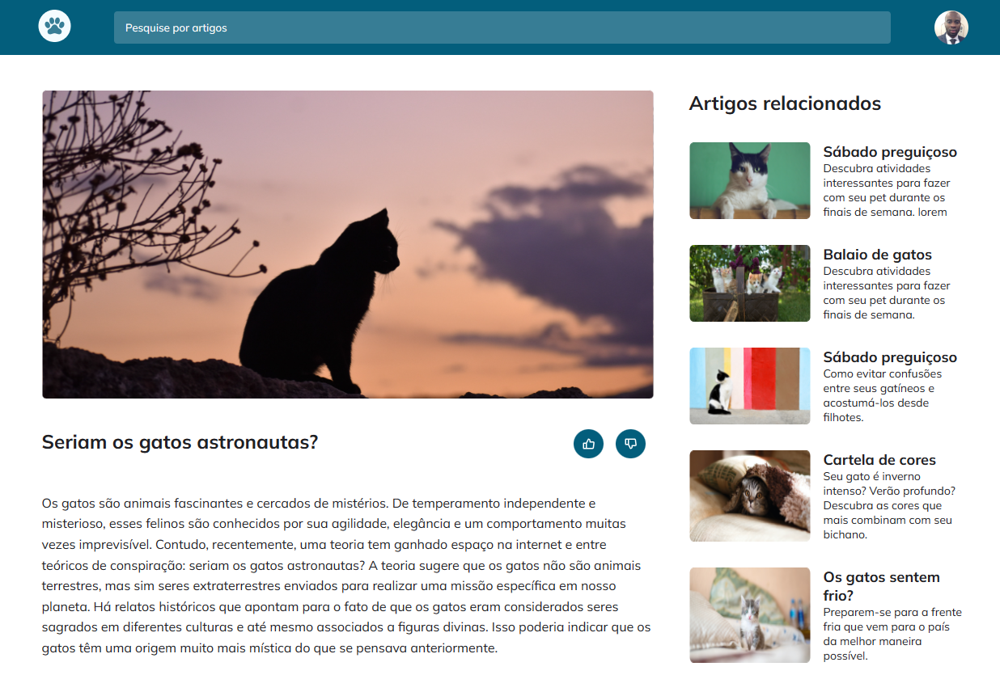

# Blog de Gatos 🐈

  

## 🖥️ Projeto

Esse foi um desafio proposto no Stage 03 da Rocketseat, a proposta do desafio foi criar um Blog de Gatos.

Neste desafio foi usado os seguintes conhecimentos:
- Mobile First: inicie o projeto deixando-o responsivo em telas menores para depois ajustar para uma versão desktop;
- Unidade de medida flexível;
- Grid;
- Variáveis no CSS;
- Cores HSL;
- Animações e transições simples.

## 🚀 Tecnologias

- HTML
- CSS
- Figma

## 🏷️ Layout

Você pode visualizar o layout do projeto através [desse link](<https://www.figma.com/file/R6sDVv6PANx0OJ1J5nlFoZ/Blog-de-Gatos-%E2%80%A2-Desafio-Explorer-(Community)?type=design&node-id=101-91&mode=design&t=HeL3jEU5n8VTbI0X-0>) e o projeto pode ser acessado através [desse link](<https://blog-dos-gatos.vercel.app/>) 
